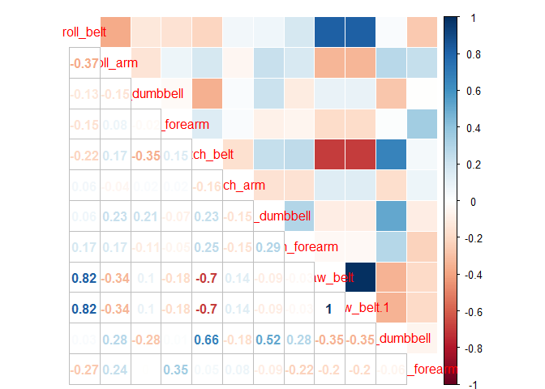
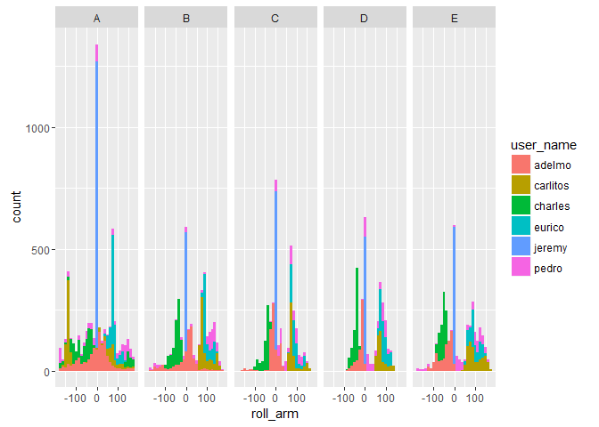
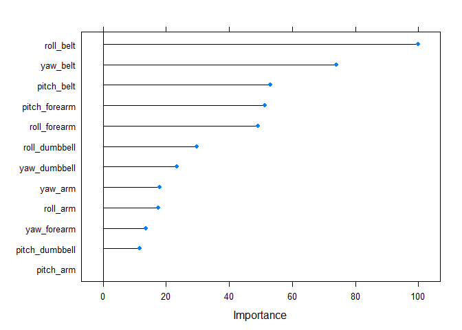
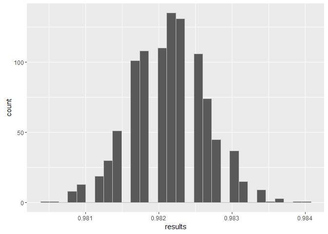

# Prediction Assignment
Vikram Vishal  
March 10, 2016  


## Understanding the Data

We first load the dataset and understanting about the data.


```r
library(caret)
```

```
## Loading required package: lattice
```

```
## Loading required package: ggplot2
```

```r
library(dplyr)
```

```
## 
## Attaching package: 'dplyr'
```

```
## The following objects are masked from 'package:stats':
## 
##     filter, lag
```

```
## The following objects are masked from 'package:base':
## 
##     intersect, setdiff, setequal, union
```

```r
library(RCurl)
```

```
## Loading required package: bitops
```

```r
library(gridExtra)
```

```
## 
## Attaching package: 'gridExtra'
```

```
## The following object is masked from 'package:dplyr':
## 
##     combine
```

```r
library(corrplot)


training <- read.csv(text = getURL("https://d396qusza40orc.cloudfront.net/predmachlearn/pml-training.csv"))
testing <- read.csv(text = getURL("https://d396qusza40orc.cloudfront.net/predmachlearn/pml-testing.csv"))

dim(training)
```

```
## [1] 19622   160
```

Given the data and its many variables, it was decided to use the variables which were not manipulated and/or had enough information to tell what they meant. This was due to the uncertainty of future interpretability rather than quantitative noise inside the model.

## Correlation matrix of the selected variables


```r
corrplot.mixed(cor(training[,c("roll_belt","roll_arm", "roll_dumbbell", "roll_forearm",
                         "pitch_belt", "pitch_arm", "pitch_dumbbell", "pitch_forearm",
                         "yaw_belt", "yaw_belt", "yaw_dumbbell", "yaw_forearm")]),
               upper = "color")
```



The focus in the model, therefore, will be to predict the "classe" of the exercises divided in A, B, C, D and E. Where:

- Class A: Exactly according to the specification
- Class B: Throwing elbows to the front
- Class C: Lifting the elbow only halfways
- Class D: Lowering the elbow only halfways
- Class E: Throwing the hips to the front

Given the roll, yaw and pitch in the belt, arm, dumbell and forearm.


```r
training %>%
  ggplot(aes(x = roll_arm, fill = user_name)) + geom_histogram() + facet_grid(~classe) 
```

```
## `stat_bin()` using `bins = 30`. Pick better value with `binwidth`.
```



It is worth noticing that in the analysis of the training data, we found a significant outlier for all arm exersices, subject "jeremy". It was decided to leave the subject in the data due to lack of information about behaviour.

## Building the model

The machine learning model used a random forest approach, using k-fold cross-validation to reduce uncertainty on future predictions. the cross validation was performed three times on a 10-fold data, whilst performing 10 trees in the random forest.


```r
base <- read.csv(text = getURL("https://d396qusza40orc.cloudfront.net/predmachlearn/pml-training.csv"))
inTrain <- createDataPartition(base$classe, p = 0.7, list = FALSE)
training <- base[inTrain,]
validation <- base[-inTrain,]

#Using all variables
fitControl <- trainControl(method = "repeatedcv", 
                           number = 10,
                           repeats = 3)

rfmod2 <- train(classe ~ ., data = training[,c("classe", "roll_belt","roll_arm", "roll_dumbbell", "roll_forearm",
                                              "pitch_belt", "pitch_arm", "pitch_dumbbell", "pitch_forearm",
                                              "yaw_belt", "yaw_arm", "yaw_dumbbell", "yaw_forearm")],
                method = "rf", ntree = 10, trControl = fitControl)
```

```
## Loading required package: randomForest
```

```
## randomForest 4.6-12
```

```
## Type rfNews() to see new features/changes/bug fixes.
```

```
## 
## Attaching package: 'randomForest'
```

```
## The following object is masked from 'package:gridExtra':
## 
##     combine
```

```
## The following object is masked from 'package:dplyr':
## 
##     combine
```

```
## The following object is masked from 'package:ggplot2':
## 
##     margin
```

```r
plot(varImp(rfmod2))
```



```r
confusionMatrix(rfmod2, newdata = predict(rfmod2, newdata = validation))
```

```
## Cross-Validated (10 fold, repeated 3 times) Confusion Matrix 
## 
## (entries are percentages of table totals)
##  
##           Reference
## Prediction    A    B    C    D    E
##          A 28.2  0.2  0.0  0.0  0.0
##          B  0.2 18.7  0.2  0.1  0.1
##          C  0.0  0.3 17.0  0.2  0.1
##          D  0.0  0.1  0.2 16.1  0.1
##          E  0.0  0.0  0.0  0.1 18.1
```

Notwithstanding the relative low ratio of variables-used vis-a-vis variables-available, we got a decent rate of predicton on the model. Further improvement could be made in specifiying the necessary variables and taking account of possible perturbations in the data.

## Expected out of sample error rate

For the expected out of sample error rate we took account on various asserted predictions and took the mean.


```r
n <- 1000
results <- rep(NA, n)
for (i in 1:n){
  results[i] <- sum(predict(rfmod2, newdata = validation) == validation$classe)/nrow(validation)
}
qplot(results, col = I("gray"))
```

```
## `stat_bin()` using `bins = 30`. Pick better value with `binwidth`.
```



```r
# The average asserted rate
mean(results)
```

```
## [1] 0.9821356
```

```r
# The mean error rate
1 - mean(results)
```

```
## [1] 0.0178644
```

### And finally

Testing our model with the provided test set


```r
solutions <- rep(NA, 20)
for(i in 1:20){
  testIdSet <- filter(testing, problem_id == i)
  solutions[i] <- as.vector(predict(rfmod2, newdata = testIdSet))
}
solutions
```

```
##  [1] "B" "A" "B" "A" "A" "E" "D" "B" "A" "A" "B" "C" "B" "A" "E" "E" "A"
## [18] "B" "B" "B"
```
